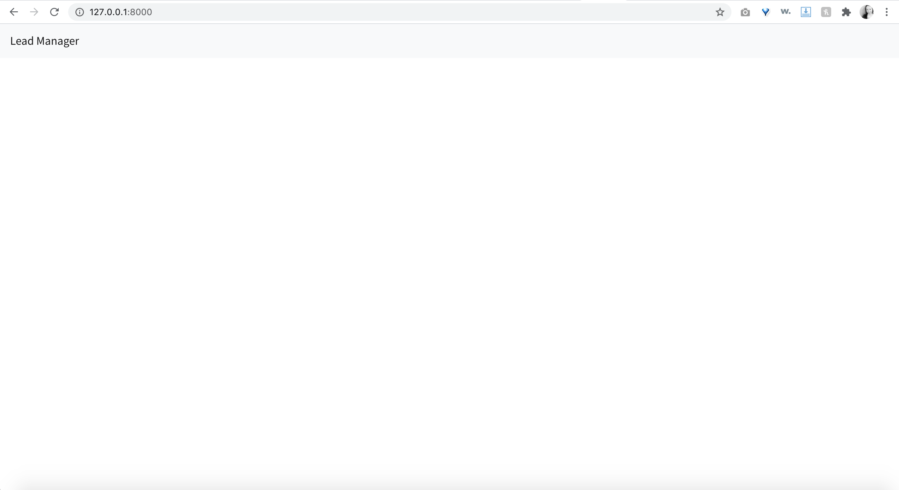

# Lead Manager React Django

Code based on [Full Stack React and Django](https://www.youtube.com/playlist?list=PLillGF-RfqbbRA-CIUxlxkUpbq0IFkX60), a video tutorial by Brad Traversy, which is based on an article [Django REST with React (Django 3 and a sprinkle of testing)](https://www.valentinog.com/blog/drf/) by Valentino Gagliari. This project uses a medium-difficulty project structure explained in [Option 1](https://www.valentinog.com/blog/drf/#django-rest-with-react-django-and-react-together) of the article.

I'll add to this repo as I complete more of the tutorial. 

For a First Milestone Template, check out the [first-milestone-template](https://github.com/KatherineMichel/lead-manager-react-django/tree/first-milestone-template) branch.

## Installation Instructions

Warning: If used in production, create a unique `SECRET_KEY` and do not make it public.

Clone the repo

```bash
$ git clone https://github.com/KatherineMichel/lead-manager-react-django/
```

`cd` into the directory

```bash
$ cd lead-manager-react-django
```

Create a virtualenv

```bash
$ pipenv shell
```

Install the Python dependencies

```bash
$ pipenv install
```

Install the JavaScript dependencies

```bash
$ npm install
```

Make migrations and migrate

```bash
$ cd leadmanager
$ python manage.py makemigrations leads
$ python manage.py migrate
```

In one terminal window, run Python dev server

```bash
$ python manage.py runserver
```

In another terminal window, compile JavaScript into `main.js` and run JavaScript dev server

```bash
$ cd .. # cd into root
$ npm run build # use this to compile only
$ npm run dev # use this to compile and run dev server
```

Go to: http://127.0.0.1:8000/

Your screen should look something like this...


